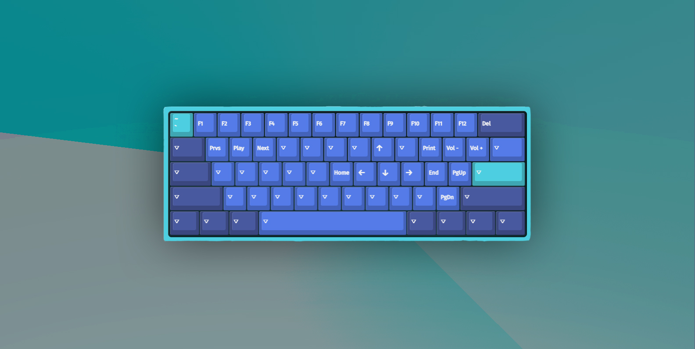
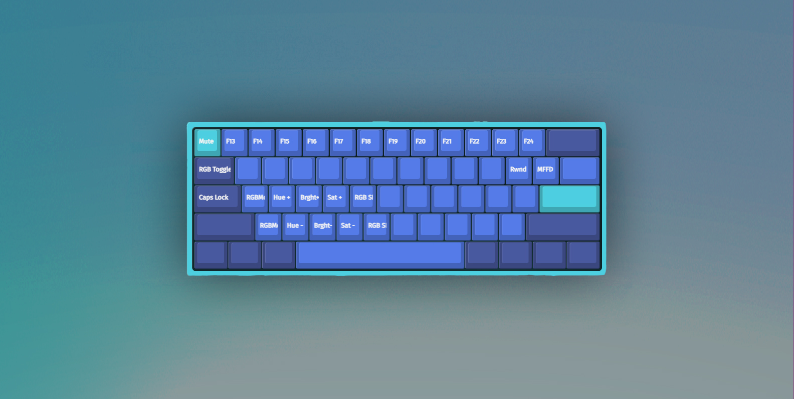

# DZ60ARROWS FIRMWARE V3

 

## Changelog:

- Replaced the Escape key with the backtick with the version without.
    - This is so keybinds like `CTRL+SHIFT+ESC` stlil work despite using the mod key.

- Replaced the `MOD+SEMICOLON` bind to be for End instead of a second Home.

- Added more and more organized LED/backlight controls.

- Added F13-F24 key macros.

- Added a mute macro and a media rewind/fastfoward keybind on the layer 2.

 

## Screenshots:

### Layer 0:

 

### Layer 1:

 

### Layer 2:

